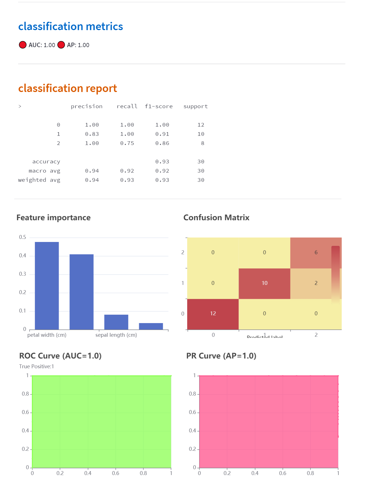

## Welcome to Data Follower!

 `机器学习` --- `聚类 分类 回归`

> **Data Follower** is a Machine Learning Web App with Streamlit and Python.

作为一款交互式机器学习应用, 它为非技术人员提供了十分简便的方法（向导式）来使用机器学习算法训练并使用模型。
通过向导页面，可以快速的完成机器学习模型训练；同时，也可以便捷的使用已经训练好的模型进行预测。 👋

[Data Follower-线上DEMO](https://shangfr-data-follower-app-mokm7x.streamlit.app/)

1. 模型训练 
	- **获取数据** : 上传结构化数据；
	- **数据描述** : 变量描述统计；
	- **学习类型设置** : 针对不同学习类型，选择目标、特征向量，进行数据清洗与转化；
	- **模型训练** : 自动训练并通过模型评价指标选择最优模型；
	- **评估** : 查看模型评估指标；

2. 模型使用
	- **预测** : 使用已经训练好的模型进行预测；
	- **查看** : 查看已经训练好的模型各项指标；

👈 从左边的下拉列表中选择一项任务，进行尝试！

操作界面

### 关于

**Data Follower**致力于为大众提供开源免费的分析、挖掘数据的工具平台。

### ChatGPT的分析

这是一个Python程序文件，主要用于数据预处理、数据分析、模型训练和预测。

app.py脚本中包含了以下函数：

| 函数名 | 描述 |
| --- | --- |
| get_file_content_as_string(path) | 读取指定路径下的文件内容并返回字符串 |
| init_state() | 初始化缓存数据的session_state |
| data_exploration(df) | 对数据进行探索性分析，并返回探索结果 |
| data_analysis(df) | 对数据进行分析，并返回分析结果 |
| data_modeling(df) | 对数据进行建模，并返回建模结果 |
| result_display(result) | 展示结果 |
| model_prediction(model, input_data) | 使用指定的模型对输入数据进行预测，并返回预测结果 |

其中，data_exploration、data_analysis和data_modeling函数都需要传入一个DataFrame类型的参数df，表示要进行分析或建模的数据。result_display函数需要传入一个字典类型的参数result，表示要展示的结果。model_prediction函数需要传入一个已经训练好的模型model和一个输入数据input_data，表示要对该输入数据进行预测。

preprocessing.py中包含了以下函数：

| 函数名 | 描述 |
| --- | --- |
| x2cor(xarray, r=0.1) | 对输入的数据进行标准化和协方差矩阵计算，并返回相关系数矩阵 |
| transformer(data, parm_ml) | 对输入的数据进行预处理，并返回处理后的数据 |

其中，x2cor函数需要传入两个参数：xarray表示要进行处理的数据，r表示相关系数矩阵中非零元素的最小值。该函数首先对输入的数据进行标准化处理，然后使用empirical_covariance函数计算协方差矩阵，并将其转换为相关系数矩阵。在转换过程中，会将相关系数小于r的元素设置为0。

其中，transformer函数需要传入两个参数：data表示要进行预处理的数据，parm_ml表示预处理所需的参数。该函数首先对输入的数据进行了一些基本的清洗操作，如删除全为空值的列和重复行等。然后根据parm_ml中指定的特征列，将数值型和类别型特征分别提取出来，并使用sklearn.preprocessing中的Pipeline和SimpleImputer等模块对这些特征进行预处理。

具体来说，数值型特征会使用SimpleImputer模块对缺失值进行填充；类别型特征会先使用SimpleImputer模块对缺失值进行填充，然后再使用OrdinalEncoder模块将类别型变量转换为数值型变量。

此外，在实际应用中，该函数还可以根据具体情况添加其他需要的预处理步骤。

......

### 反馈与建议

- 作者：[shangfr](https://shangfr.site)
- 邮箱：<shangfr@foxmail.com>

---------
感谢阅读这份文档。

[捐助](http://oss-cdn.shangfr.site/payment.png)。