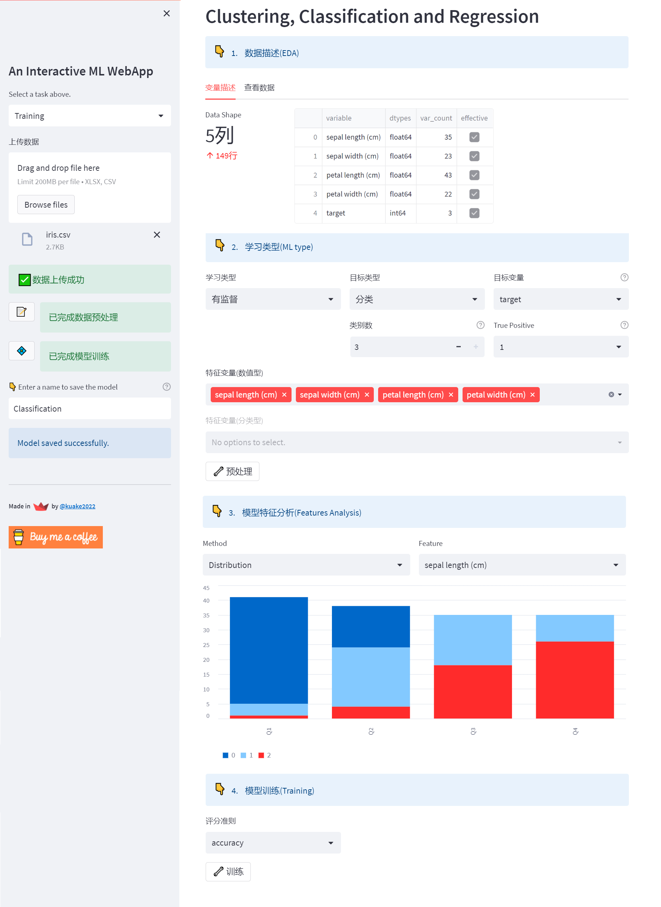
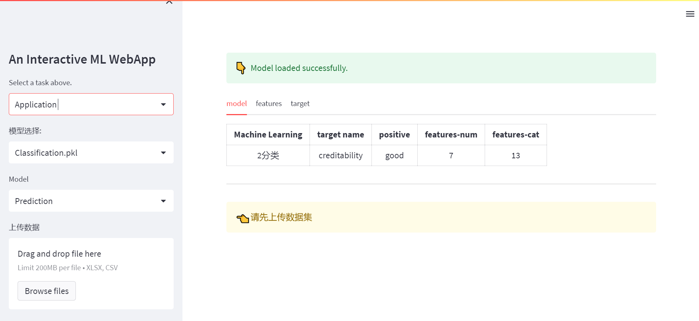
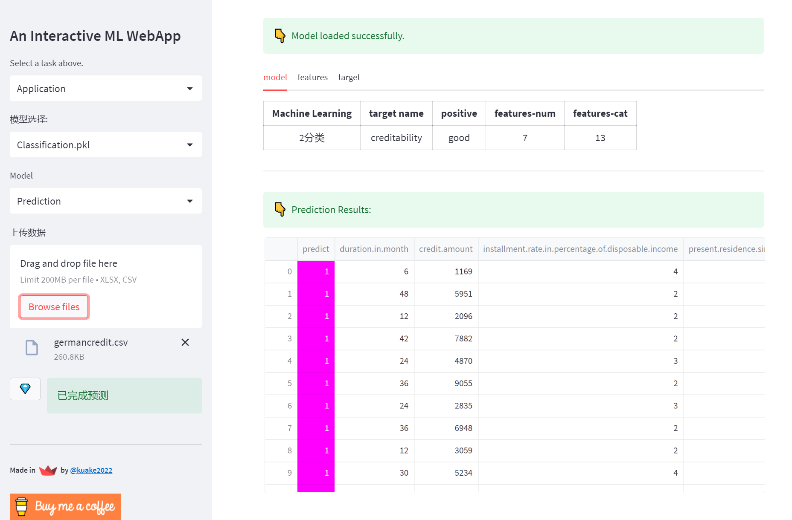

## Welcome to Data Follower!

 `机器学习` --- `聚类 分类 回归`

> **Data Follower** is a Machine Learning Web App with Streamlit and Python.

作为一款交互式机器学习应用, 它为非技术人员提供了十分简便的方法（向导式）来使用机器学习算法训练并使用模型。
通过向导页面，可以快速的完成机器学习模型训练；同时，也可以便捷的使用已经训练好的模型进行预测。 👋

[Data Follower-线上DEMO](https://shangfr-data-follower-app-mokm7x.streamlit.app/)

1. 模型训练 
	- **获取数据** : 上传结构化数据；
	- **数据描述** : 变量描述统计；
	- **学习类型设置** : 针对不同学习类型，选择目标、特征向量，进行数据清洗与转化；
	- **模型训练** : 自动训练并通过模型评价指标选择最优模型；
	- **评估** : 查看模型评估指标；

2. 模型使用
	- **预测** : 使用已经训练好的模型进行预测；
	- **查看** : 查看已经训练好的模型各项指标；

👈 从左边的下拉列表中选择一项任务，进行尝试！

操作界面

### 关于

**Data Follower**致力于为大众提供开源免费的分析、挖掘数据的工具平台。

### 反馈与建议

- 作者：[shangfr](https://shangfr.site)
- 邮箱：<shangfr@foxmail.com>

---------
感谢阅读这份文档。

[捐助](http://oss-cdn.shangfr.site/payment.png)。